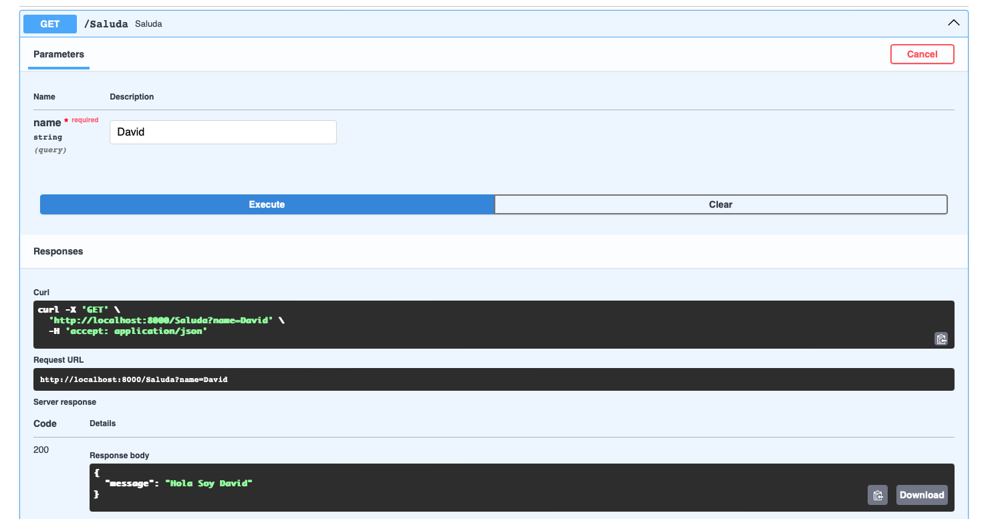

MFLOW


Motivación:

Este proyecto híbrido y complejo tiene como objetivo desarrollar un modelo multimodal para predecir el engagement de los Puntos de Interés Cultural (POIs), utilizando tanto metadatos como imágenes. La idea es fusionar la información proporcionada por ambos tipos de datos para mejorar la predicción y generalización del modelo.

El trabajo se desarrolló en profundidad, desde la fase de Análisis Exploratorio de Datos (EDA) hasta la optimización de hiperparámetros mediante el uso de Optuna. Durante este proceso, se realizaron numerosos experimentos para estudiar y validar cada una de las decisiones tomadas en el diseño del modelo.
Preprocesamiento:

En el análisis de los datos, se exploraron diferentes métodos de preprocesamiento, incluyendo:

    -OneHotEncoding vs Embeddings: Se probó el uso de OneHotEncoding para tratar una variable categórica relevante, pero se observó que esta técnica tenía limitaciones al no poder capturar las similitudes semánticas entre las categorías. Como resultado, se optó por el uso de embeddings, lo cual permitió reducir la dimensionalidad de la entrada, mejorar la capacidad del modelo para generalizar y evitar el overfitting.

    -Cálculo del target: Se exploraron diversas fórmulas para calcular el target, y se optó por la que proporcionaba mejores resultados en combinación con los datos de entrada.

    -Arquitecturas de red y Transfer Learning: Se probaron arquitecturas más simples y modelos preentrenados, utilizando Transfer Learning y Finetuning, lo cual mejoró el rendimiento del modelo.

    -Optimización de hiperparámetros: Después de experimentar con varios enfoques, se implementó una optimización más precisa mediante Optuna, una herramienta que permitió encontrar la mejor combinación de hiperparámetros para mejorar la precisión del modelo.

Resultados y análisis de las imágenes:


Primera Imagen: Análisis de la relación entre activación, precisión y número de épocas

En esta imagen se muestra un gráfico tipo Parallel Coordinates Plot que permite comparar cómo cambian las métricas en función de diferentes parámetros del modelo. A continuación, se interpreta cada uno de los elementos clave:

    Relación entre la función de activación y la precisión:

        Las ejecuciones que usaron ReLU como función de activación lograron mejores resultados de precisión en el conjunto de entrenamiento, alcanzando valores cercanos al 63.5% de accuracy.

        Las ejecuciones que emplearon LeakyReLU obtuvieron una precisión ligeramente inferior, cerca del 61.5%–62.5%.

    Relación entre el número de épocas y la precisión:

        Se observa que el número de épocas tiene un impacto significativo en la precisión del modelo. Las mejores precisiones se alcanzaron con 20 épocas, mientras que con 6 o 10 épocas la precisión fue considerablemente más baja.

        Esto sugiere que el modelo se beneficia de un mayor número de épocas para ajustarse correctamente a los datos.

    Mejor ejecución:

        La ejecución que logró el mejor rendimiento (precisión >63.5%) usó ReLU como función de activación y 20 épocas de entrenamiento.


En esta imagen, el análisis se enfoca en la precisión alcanzada en el conjunto de prueba (test) para las diferentes configuraciones de la función de activación:

    Mejor precisión con LeakyReLU:

        Una de las ejecuciones con LeakyReLU alcanzó una precisión de test de aproximadamente 62.42%, superando a la ejecución con ReLU, que alcanzó una precisión de test más baja (alrededor de 60.4%).

        Aunque ReLU parecía funcionar mejor en el conjunto de entrenamiento, LeakyReLU mostró una mejor capacidad de generalización al conjunto de prueba.

    Razones detrás del mejor rendimiento de LeakyReLU:

        LeakyReLU permite un pequeño gradiente en los valores negativos, lo que mejora el flujo de gradientes y acelera la convergencia del modelo.

        Además, LeakyReLU mostró menor overfitting en este caso, ya que aunque ReLU obtuvo mejores resultados en el entrenamiento, se ajustó demasiado a los datos de entrenamiento, lo que afectó su capacidad de generalización.

        


En la tercera imagen, se compara la distribución de las precisiones en el conjunto de test entre las ejecuciones con ReLU y LeakyReLU:

    Mejor comportamiento de LeakyReLU:

        LeakyReLU mostró una distribución más rica y estable en cuanto a precisión en el conjunto de test, con mejores resultados generales que ReLU.

        La mediana de LeakyReLU también superó a la de ReLU, aunque por una diferencia ligera.

    Incertidumbre en el rendimiento de ReLU:

        Con solo una ejecución con ReLU, no se puede concluir de manera definitiva si ReLU es consistentemente peor que LeakyReLU. Sin embargo, en este caso, el único resultado obtenido con ReLU fue inferior al mejor resultado obtenido con LeakyReLU.

    Potencial de mejora de LeakyReLU:

        Aunque hubo algo de variabilidad en los resultados, no se observó la presencia de valores extremos ni outliers anómalos. Esto sugiere que LeakyReLU tiene más potencial de mejora si se realiza un ajuste más fino de otros hiperparámetros como la tasa de aprendizaje (lr), el tamaño de lote (batch_size) o la regularización.

Unificación de los resultados

Al integrar los resultados de las tres imágenes, se observa que, en general, el modelo con LeakyReLU muestra una mejor capacidad de generalización que el modelo con ReLU. Aunque ReLU presentó mejores resultados en el conjunto de entrenamiento, la capacidad de generalización de LeakyReLU en el conjunto de prueba fue superior. Esto se debe a que LeakyReLU evita el problema de dead neurons al permitir un pequeño gradiente en valores negativos, lo que mejora la convergencia del modelo y reduce el overfitting. Además, la combinación de 20 épocas y una optimización cuidadosa de los hiperparámetros sugiere que LeakyReLU tiene un mayor potencial de mejora si se realiza un ajuste fino adicional.
Conclusiones finales:

    El uso de LeakyReLU ha demostrado ser la mejor opción para este modelo multimodal de predicción de engagement en Puntos de Interés Cultural, ya que no solo mejora la precisión en el conjunto de prueba, sino que también muestra mayor estabilidad y capacidad de generalización.

    Se recomienda realizar un ajuste más fino de los hiperparámetros, como la tasa de aprendizaje, el tamaño del lote y la regularización, para maximizar el rendimiento de LeakyReLU y evitar posibles overfitting en futuras iteraciones.

    Es posible que ReLU pueda ser útil en ciertos casos, pero en este escenario, LeakyReLU ha demostrado ser más robusto y prometedor en términos de rendimiento y estabilidad general.      


FASTAPI

Incluyo en el repositorio el archivo playground_practica, que contiene el detalle de los módulos creados.

A continuación, adjunto capturas del código principal empleado en la terminal, así como capturas de las pruebas realizadas en Swagger con los diferentes modos.




```bash
pip install "fastapi[standard]"

fastapi run playground_practic.py

fastapi run playground_pract.py --reload


